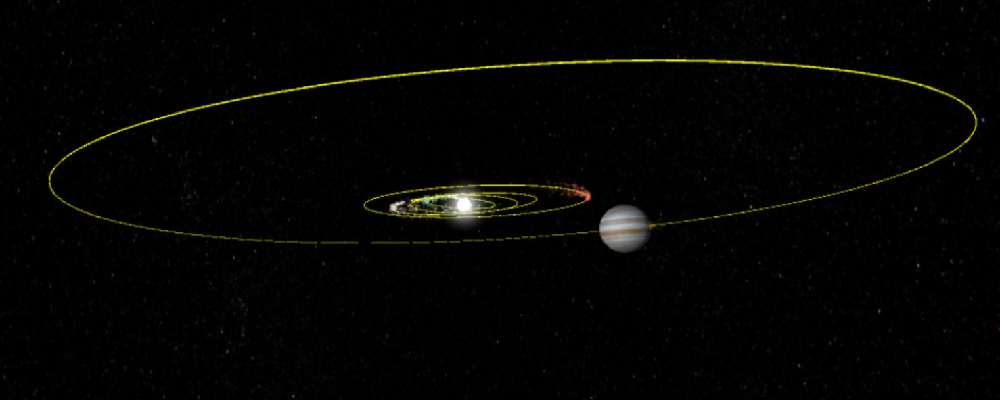
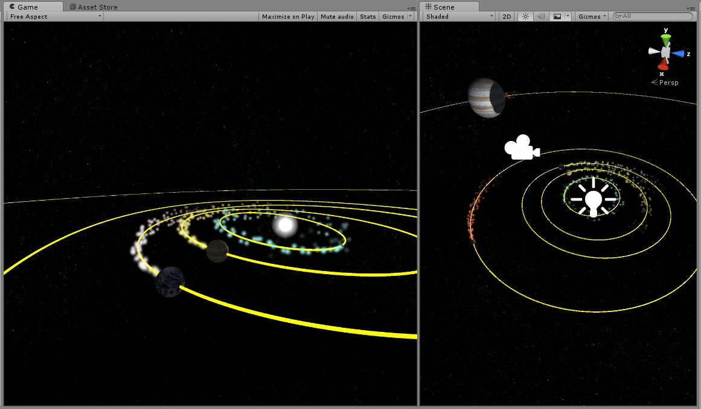

# OculusOrbiter

An orbit simulator for Oculus Rift, powered by Unity.

This software uses Unity's built-in support for Oculus Rift.

Planets are scaled so that they are visible in Oculus, but their
relative positions are to real scale.

## Screenshots

